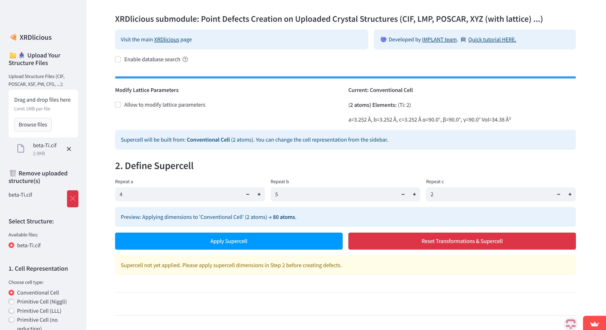
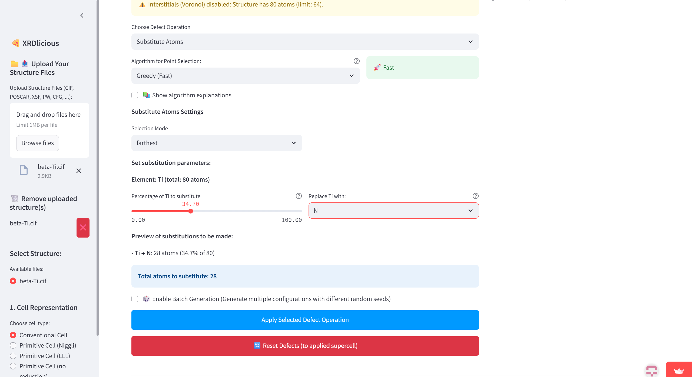
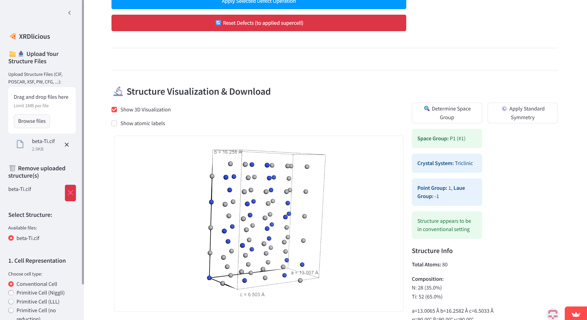

# XRDlicious - point defects creation 
[XRDlicious](http://xrdlicious.com/) submodule for creating random point defects (interstitials, substitutes, vacancies, clusters, bubbles) in crystal structures. Also allows to fix atoms in POSCAR for Selective dynamics within VASP. Try it here: [xrdlicious-point-defects.streamlit.app/](https://xrdlicious-point-defects.streamlit.app).  
- Video tutorial at [YouTube](https://www.youtube.com/watch?v=cPp-NPxhAYQ&t=6s&ab_channel=Implantgroup) for creating point defects. 
- Video tutorial at [YouTube](https://www.youtube.com/watch?v=dvC8ohlW51k) for fixing atoms for Selective Dynamics in POSCAR within VASP .

If you like this application, **please cite**: [Lebeda, Miroslav, et al. XRDlicious: an interactive web-based platform for online calculation of diffraction patterns and radial distribution functions from crystal structures. Applied Crystallography, 2025, 58.5.](https://journals.iucr.org/j/issues/2025/05/00/hat5006/index.html)

For more computationally demanding calculations with more extensive data, please compile the code locally on your computer (follow the manual below).
# **How to compile and run the XRDlicious submodule for point defects locally:** 

### **Prerequisities**: 
- Python 3.x (Tested 3.12)
- Console (For Windows, I recommend to use WSL2 (Windows Subsystem for Linux))
- Git (optional for downloading the code)
  

### **Compile the app**  
Open your terminal console and write the following commands (the bold text):  
(Optional) Install Git:  
      **sudo apt update**  
      **sudo apt install git**    
      
1) Download the XRDlicious code from GitHub (or download it manually without Git on the following link by clicking on 'Code' and 'Download ZIP', then extract the ZIP. With Git, it is automatically extracted):  
      **git clone https://github.com/bracerino/GUI-point-defects.git**

2) Navigate to the downloaded project folder:  
      **cd GUI-point-defects/**

3) Create a Python virtual environment to prevent possible conflicts between packages:  
      **python3 -m venv point_defects_env**

4) Activate the Python virtual environment (before activating, make sure you are inside the xrdlicious folder):  
      **source point_defects_env/bin/activate**
   
5) Install all the necessary Python packages:  
      **pip install -r requirements.txt**

6) Run the XRDlicious app (always before running it, make sure to activate its Python virtual environment (Step 4):  
      **streamlit run app.py**

### Tested Python packages
Python 3.12.3

- streamlit==1.45.1  
- numpy==1.26.4  
- matplotlib==3.10.3  
- ase==3.25.0  
- matminer==0.9.3  
- pymatgen==2025.5.28  
- py3Dmol==2.4.2  
- plotly==6.1.1  
- streamlit-plotly-events  
- setuptools  
- mp-api==0.45.3  
- aflow==0.0.11  
- pillow==11.2.1  
- pymatgen.analysis.defects==2025.1.18  
- psutil==7.0.0  

### Workflow illustration
- Upload structure and create supercell
- Select mode and its settings (introduce interstitials, vacancies, or substitutes). For less than 500 atoms in the structure, it is possible to select to place the defects either as far away as possible, as near as possible, or something in between these two cases using fast greedy algorithm (see the description on the application website). For higher number, it is possible to place the defects only randomly do to large computational demand.

- Apply the settings and download the modified defected structure.

